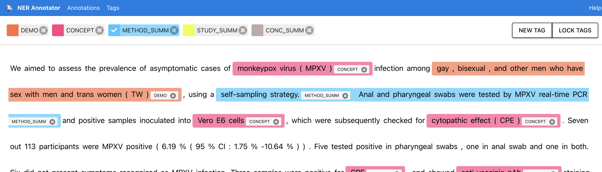

# medRxiv_Entity_Extractor

We are developing a system to automate the retrieval of clinical trial results from recent submissions to the medRxiv research paper archive.

Since the nature of the publicates varies in language structure and methodology presentation (as it is published by different authors, universities, etc..), we are implementing various entity recognition approaches to pick up pertinent data.

## Background

The problem: We want to scrape the most recent submissions and gather results from "Results" sections and/or Tables reporting results.

The challenge: Result sections are written differently, tables are displayed differently, methodologies are different, etc.. We need a find a way to normalize/group similar results. As an initial challenge - we are going to train an Entity Recognition model to pick up on methodologies, subject matter - anything consisten we think our tuned transformer can pick up on after decent labeling.

We are also going to extract tables from the full paper pdfs via a couple methods. One using tabula , and one will be using layoutMLv3. Both of these methods will input the pdf tables into dataframes which can be manipulated and sent to our Cloud Platform.

### Structure of medRxiv archive listings page

<p float="left">
  
   
  
</p>
We can loop through each html element and create a dataframe to work with.

```
def extract_article_text(self):

    res = requests.get('https://www.medrxiv.org/archive')
    content = res.content
    soup = BeautifulSoup(content)
    
    a = soup.find_all('a', {"class": "highwire-cite-linked-title"})
    b = soup.find_all('span',{"class":'highwire-citation-authors'})
    c = soup.find_all('span', {"class": "highwire-cite-metadata-doi highwire-cite-metadata"})
    
    assert len(a) > 0, 'No Articles Found'
    assert len(a) == len(b) == len(c), 'Mismatched article metadata'

    list_dict = []
    for ix,(i,j,k) in enumerate(zip(a,b,c)):
        list_dict.append({'title':i.text,'authors':j.text,'href':k.text.partition('doi: ')[2].strip().replace('doi.org','www.medrxiv.org/content') +'v1','full_pdf':k.text.partition('doi: ')[2].strip().replace('doi.org','www.medrxiv.org/content') + 'v1.full.pdf'})

    return pd.DataFrame(list_dict)
```
<p float="center">
    
</p>

### Structure of medRxiv paper summary

<p float="left">
  
  
</p>

Now we will loop through our DataFrame href column and extract the abstract text.

```
    def access_archive_listing(self, input_df):
        
        abstracts = []  
        for ix,href in enumerate(input_df['href']):
            res = requests.get(href)
            content = res.content
            soup = BeautifulSoup(content)
            for ix,i in enumerate(soup.find_all('div',{"class":"section abstract"})):
                abstracts.append(i.text.partition('Abstract')[2].replace('\n',''))

        abstracts = list(set(abstracts))
        
        try:
            assert len(abstracts) == len(input_df['href']),f"Warning: # Abstracts != # Links {len(abstracts),len(input_df['href'])}"
        except Exception as e:
            print(e)
            
        input_df['abstracts'] = abstracts
        
        return input_df
```


We will train a custom NER model to pick up on concepts, methods, and study results.

### NER Model Training and Annotation

My go to annotation tool is Tecoholic's NER annotator that I use consistently. We will create and label a few tags in a collection of paper abstracts and then use sPacy to train and fine tune a model.

<p float="left">
  
  
</p>

The tool spits out an annotation json file, which we can read in, manipulate a bit, and then train.
```
    f = open('./annotations.json')
    annot = json.load(f)


    list_data = annot['annotations']
    train_data = []
    for i in list_data:
        
        try:
            str1 = i[0]
            ent1 = i[1]
            train_data.append((str1,ent1))
            
        except Exception as e:
            print('error',e)
```

Example training code:

```
    other_pipes = [pipe for pipe in nlp.pipe_names if pipe != 'ner']
    with nlp.disable_pipes(*other_pipes):  # only train NER
        optimizer = nlp.begin_training()
        for itn in range(n_iter):
            random.shuffle(train_data)
            losses = {}
            for text, annotations in tqdm(train_data):
                doc = nlp.make_doc(text)
                example = Example.from_dict(doc, annotations)
                nlp.update(
                    [example],  
                    drop=0.2,  
                    sgd=optimizer,
                    losses=losses)
            print(itn,losses)
```
Now lets test out our model on some test abstracts.


<p float="center">
  
  
</p>

Not terrible - keep in mind this was only trained on ~25 or so abstracts due to time constraints. Given more time - the approach to annotation would be much more careful/discussed as a group.


Now we will loop through our extract abstracts in our DataFrame, run our NER model over the text, and extract the predicted entities. For now - we will put concepts and results in arrays, and summaries in strings. Ideally we would reconstruct these entities with linking and relationships.

```
        
    def extract_abstract_entities(self, input_df):
        
        abstract_ner_model = spacy.load('./abstract_ner_trainer/model/')
        
        concepts_batch = []
        summary_batch = []
        method_batch = []
        conclusion_batch = []
        confidence_intervals_batch = []
        results_batch = []
        
        for i in input_df['abstract']:
            
            concepts = []
            summary = ''
            method = ''
            conclusion = ''
            confidence_intervals = []
            results = []
            
            doc1 = abstract_ner_model(i)
            
            #displacy.render(doc1,style = 'ent')
            
            for j in doc1.ents:
                if j.label_ == 'CONCEPT':
                    concepts.append(j.text)

                if j.label_ == 'METHOD_SUMM':
                    method += j.text

                if j.label_ == 'STUDY_SUMM':
                    summary += j.text

                if j.label_ == 'CONC_SUMM':
                    conclusion += j.text

                if j.label_ == 'RESULTS':
                    results.append(j.text)

                if j.label_ == 'CONF_INT':
                    confidence_intervals.append(j.text)
                    
            concepts_batch.append(concepts)
            summary_batch.append(summary)
            method_batch.append(method)
            conclusion_batch.append(conclusion)
            confidence_intervals_batch.append(confidence_intervals)
            results_batch.append(results)
            
        input_df['concepts'] = concepts_batch
        input_df['summary'] = summary_batch
        input_df['method'] = method_batch
        input_df['conclusion'] = conclusion_batch
        input_df['results'] = results_batch
        input_df['confidence_intervals'] = confidence_intervals_batch
        
        return input_df
```


### Look inside full pdf papers

<p float="center">
  
   
  
</p>


### Example tables from papers

<p float="left">
  
   
  
</p>

As we can see above, papers vary greatly in terms of paper content, file makeup, table formatting, etc.

As a first step - 
Lets extract tables with tabula's read_pdf() function.
Since there is no consistent structure to the tables (all from different studies, authors, universities), we will just add all tables as DataFrames within a paper to a list.

```

    def extract_pdf_tables(self, input_df):

        full_tables = []
        for i in input_df['full_pdf']:
            tables = []
            dfs = read_pdf(i, pages='all')
            for table in dfs:
                tables.append(table)
            full_tables.append(tables)
        input_df['tables'] = full_tables

        return input_df
```